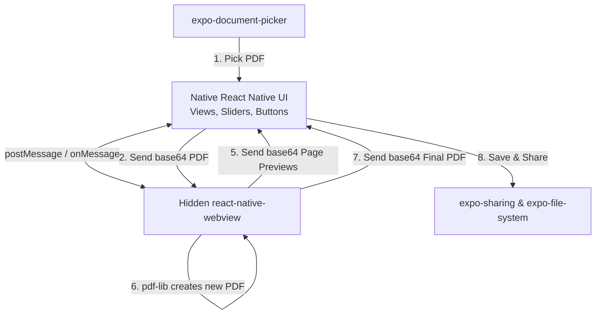

# SoftPage iOS App - Overall Plan

Welcome! This document outlines the plan to port your web-based PDF recoloring tool, **SoftPage**, to a native iOS application using **React Native** and **Expo**.

Because React Native does not run on a standard browser engine with HTML5 `<canvas>` or direct DOM APIs, the core processing engine (recoloring, PDF rendering, PDF exporting) will run inside a hidden `WebView`. The native UI will communicate with this engine using standard messaging APIs (`postMessage`/`onMessage`).

---

## 1. Prerequisites (What You Need to Install)

Since you are targeting **iOS** but may be working on **Windows** (or Mac), we will use **Expo Go**. This allows you to run, test, and debug the iOS app directly on your physical iPhone without needing a Mac, Xcode, or Apple Developer account!

Here is what you need to download and install:

### On Your Computer (Windows/Mac)
1. **Node.js (LTS Version):** If not already installed, download and install Node.js (v18 or v20 is recommended) from [nodejs.org](https://nodejs.org/).
2. **Git:** You already have Git installed since the project is in a Git repo.
3. **VS Code (Recommended):** The best code editor for React Native. You can optionally install the **Expo Tools** extension in VS Code.

### On Your iOS Device (iPhone/iPad)
1. **Expo Go:** Download the official **Expo Go** app from the Apple App Store. It is free and allows you to test your app live on your phone.
2. **Network Connection:** Ensure your computer and your iPhone are connected to the **same Wi-Fi network**.

---

## 2. Technical Architecture

Here is how the mobile app will be structured:



### Key Native API Libraries:
- **`expo-document-picker`**: Let's user choose a PDF from the iOS Files app.
- **`expo-file-system`**: For reading, writing, and creating temporary file URI representations.
- **`expo-sharing`**: Triggers the native iOS share sheet, allowing the user to Save to Files, AirDrop, message, or email the recolored PDF.
- **`@react-native-async-storage/async-storage`**: Used to save custom user palettes persistently.
- **`react-native-webview`**: Runs the hidden PDF processing engine in an isolated sandboxed browser environment.

---

## 3. Proposed Directory Structure

In the `softpage-ios` workspace, we will create the following layout:

```text
softpage-ios/
├── assets/                  # App icons and splash screen
├── src/
│   ├── components/          # Reusable native UI components
│   │   ├── PaletteSelector.tsx
│   │   ├── SettingsPanel.tsx
│   │   ├── CustomPaletteModal.tsx
│   │   ├── PagePreview.tsx
│   │   └── ProgressModal.tsx
│   ├── core/
│   │   └── processorHtml.ts # Contains the entire HTML/JS string injected into the WebView
│   ├── hooks/
│   │   └── useWebViewBridge.ts # Custom hook to manage WebView communication
│   ├── styles/
│   │   └── global.css       # Tailwind/NativeWind global CSS
│   ├── types/
│   │   └── index.ts         # Shared TypeScript interfaces
│   └── utils/
│       └── storage.ts       # AsyncStorage helpers for palettes
├── app/                     # Expo Router structure (pages)
│   ├── _layout.tsx          # Root Layout (with navigation headers)
│   ├── index.tsx            # Home screen (Main editor)
│   └── about.tsx            # About/Privacy screen
├── tailwind.config.js       # Styling config for NativeWind
├── app.json                 # Expo configuration
├── package.json             # Core dependencies
└── tsconfig.json            # TypeScript configuration
```

---

## 4. WebView Recoloring Processor (The Engine)

The WebView will load an inline HTML string that bundles the following:
1. **`pdfjs-dist` CDN script**: To load and render PDF pages onto a hidden canvas.
2. **`pdf-lib` CDN script**: To assemble the final recolored pages back into a PDF document.
3. **Recoloring logic**: Replicating `recolor.ts` and `sampling.ts` exactly.
4. **Communication code**:
   - Listen for commands from the Native UI (e.g. `LOAD_PDF`, `RENDER_PREVIEW`, `PROCESS_DOCUMENT`, `CANCEL`).
   - Run the processing pipeline.
   - Post results back to Native UI (e.g. progress updates, image previews, and the final exported PDF as a base64 string).

---

## 5. Next Steps & Timeline

To begin the implementation:
1. **Initialize the Expo application** in the `softpage-ios` folder.
2. **Install the necessary dependencies** (`nativewind`, `react-native-webview`, etc.).
3. **Configure Tailwind/NativeWind** for styling.
4. **Create the WebView processor code** containing all the recoloring and PDF logic.
5. **Develop the UI Components** matching the beautiful dark, minimal aesthetic of your original web app.
6. **Implement the file picking and sharing bridges**.
7. **Test and verify** the application on Expo Go.
